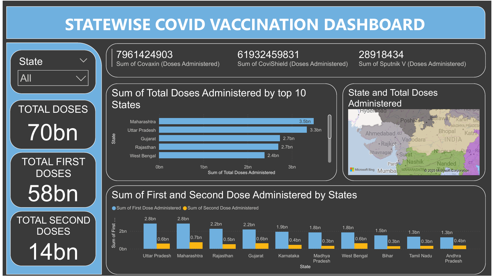

# 🧠 COVID-19 Vaccination Insights – India (Python + Power BI)

This project presents a complete data-driven report on India’s COVID-19 vaccination drive using both Python and Power BI. It combines real-world data analysis, state-wise comparisons, vaccine type insights, and interactive dashboards — all structured around a cleaned, custom dataset.

---

## 🎯 Objectives

- Clean and prepare state-wise COVID-19 vaccination data
- Perform exploratory data analysis using Python
- Visualize dose distribution, state performance, and brand usage
- Build an interactive Power BI dashboard to support stakeholder insights

---

## 🧪 Project Flow

1. **Data Collection**  
   - Sourced from official Indian vaccination statistics (via Kaggle)
   
2. **Data Cleaning (Python)**  
   - Removed irrelevant columns  
   - Ensured numeric conversions for doses  
   - Generated a clean `.csv` file for reuse

3. **Exploratory Data Analysis (Python)**  
   - Bar charts for top vaccinated states  
   - First vs Second dose comparisons  
   - Correlation heatmap of dose metrics  
   - Population-based vaccine coverage (optional)

4. **Power BI Dashboard (1 Page)**  
   - KPI cards for total, first, and second doses  
   - Clustered bar chart: first vs second dose by state  
   - Filled map focused on Indian geography  
   - Multi-row card: Covishield, Covaxin, Sputnik V totals  
   - Interactive slicer to filter by state

---

## 🔍 Project Highlights

- End-to-end data pipeline from raw to cleaned data  
- Python notebook to demonstrate EDA skills  
- Power BI dashboard for business storytelling  
- Visuals aligned with real-world public health questions  
- Dual tool usage: technical + business view

---

## 🛠️ Tech Stack

| Tool                | Purpose                              |
|---------------------|---------------------------------------|
| Python (Jupyter)     | Cleaning, analysis, and visualization |
| Pandas, Matplotlib, Seaborn | Data wrangling and charts       |
| Power BI Desktop     | Interactive dashboard creation        |

---

## 📂 Files Included

| File                                | Description                          |
|-------------------------------------|--------------------------------------|
| `covid_vaccine_statewise_cleaned.csv` | Final cleaned dataset (CSV)         |
| `covid vaccination statewise.ipynb`      | Python notebook for EDA              |
| `covid_vaccine_dashboard.png`       | Power BI screenshot                  |
| `covid_dashboard.pbix`| Power BI report (1 page)             |
| `README.md`                         | This documentation file              |

---

## 📊 Dashboard Overview

📄 **Page – Vaccination Overview (Power BI)**

- KPI cards: Total, First, Second Dose
- Clustered Bar Chart: First vs Second dose (Top 10 states)
- India-focused map view of total doses
- Multi-row card showing Covishield, Covaxin, and Sputnik V totals
- State slicer for interactive filtering

---

##📌 Key Insights

- Maharashtra and Uttar Pradesh lead in total vaccinations  
- Disparity observed between first and second doses in many states  
- Covishield is the most widely administered vaccine  
- Urbanized states show higher completion of second doses  
- Interactive filters enable deep exploration per state

---

## 📁 Dataset Source

- Government of India Open Data (via Kaggle)
- Cleaned and filtered for analysis and reporting
